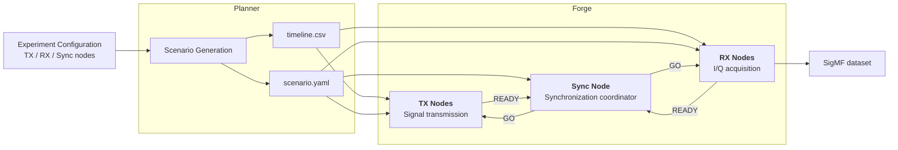

# CorteXforge
CorteXforge is an end-to-end framework designed to automate the generation and execution of radio dataset experiments on the [SLICES-RI/CorteXlab](https://www.cortexlab.fr/doku.php?id=start) testbed.
It relies on the [GNU Radio](https://www.gnuradio.org) environment to record labeled transmissions of various signals.

## Overview
This project is organized into three main components:
- Scenario generation: this part produces configuration files describing the experiment setup. It creates: 
  - a `scenario.yaml` file defining which nodes will be used and their respective roles;
  - an `timeline.csv` file orchestrating the timing and sequence of transmissions.
- Experiment execution: this part deploys and executes the generated experiment definitions (`timeline.csv`) directly on the [SLICES-RI/CorteXlab](https://www.cortexlab.fr/doku.php?id=start) nodes.
- Dataset API: this part provides easy access to pre-generated datasets created with CorteXforge.

## Architecture

CorteXforge separates experiment planning from execution. The **Planner** generates the RF transmission timeline and the CorteXlab deployment scenario, while **Forge** executes the experiment across dedicated transmitter, receiver, and synchronization nodes.




## Quick start (User Guide) :rocket:

### 1. Scenario Generator
:warning: This module is implemented in Python 3.13 !

The scenario generator can be executed locally before  deployment in Slices/CorteXlab. It allows configuration of experimental parameters such as:
- selected nodes to be used
- recording duration (in seconds)
- modulations
- frequencies
- sample rates
- overlapping transmissions


#### Example usage
- ```git clone https://github.com/Andreaj42/CorteXforge.git```
- ```cd CorteXforge```
- ```python3.13 -m venv .venv```
- ```. .venv/bin/activate```
- ```pip install -e .[planner]```
- ```cortexforge planner --username andrea_joly --rx-nodes mnode27 mnode25 --tx-nodes mnode16 mnode17 --sync-node mnode12 --modulations OOK,16QAM,32QAM,QPSK --duration 30 --rx-frequency 2450000000 --rx-gain 20 --rx-sample-rate 5000000 --tx-frequency 2450000000 --tx-gain 30  --n-signals 96 --seed 42```


### 2. Forge (Experiment Execution)
:warning: This part must be executed directly on the Slices/CorteXlab testbed !

Each node defined before in the previous stage will run a GNU Radio flowgraph according to the configuration.

#### Docker Image :whale:
To simplify deployment and ensure reproducibility, we provide a Docker image.
This image extends the standard CorteXlab toolchain and adds the required dependencies for forge.

#### Example usage
First, connect to the testbed:
- ```ssh <username>@gw.cortexlab.fr```

Then, book the testbed with your selected nodes (nodes: 12, 16, 17, 25, and 27 here): 
- ```oarsub -l {"network_address in ('mnode27.cortexlab.fr', 'mnode25.cortexlab.fr', 'mnode16.cortexlab.fr', 'mnode17.cortexlab.fr', 'mnode12.cortexlab.fr')"}/nodes=5,walltime=0:30:00 -r "2026-10-21 12:00:00"```

:warning: The allocated wall time must be long enough to cover the complete experiment, including deployment and execution.

Move the previously generated ```experiment``` folder into your **Cortexlab** home, then run:
- ```minus task create experiment -f```
- ```minus task submit experiment.task```

To monitor your experiment, use: 
- ```minus testbed status```
- ```minus log```

To delete a job, use:
- ```oardel <job_id>```


### 3. Pre-generated Datasets

Just want to use a dataset without running your own experiments? Simply download one of the pre-generated datasets produced with CorteXforge.

First, install CorteXforge:
- ```pip install cortexforge```

List all available datasets:
- ```cortexforge datasets list```

Download a dataset:
- ```cortexforge datasets download <dataset_name>```

For instance:
- ```cortexforge datasets download modfore```

## Useful links :link:
- [xp.cortexlab.fr](xp.cortexlab.fr/app)
- [wiki.cortexlab.fr](wiki.cortexlab.fr)
